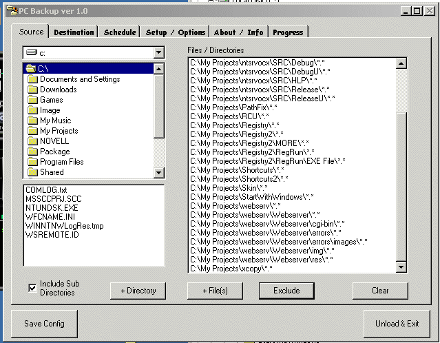



## PC Backup

### Description

Adapted from AutoBackup submited by Alexandre Moro.

Backs up or copies data from your PC to the destination of you choice.

This version creates the entire directory structure on destination, rechecks items for just before backup for any changes, Loads with windows, customizable destination directory name (e.g. F:\My Projects - 09-18-2001)

To mention a few...
 
### More Info
 
Source Dir(s) + File(s)

Destination Dir

Execution schedule

             |
---                |---
**Submitted On**   |2001-09-19 20:26:38
**By**             |[WadeG](https://github.com/Planet-Source-Code/PSCIndex/blob/master/ByAuthor/wadeg.md)
**Level**          |Intermediate
**User Rating**    |4.0 (24 globes from 6 users)
**Compatibility**  |VB 4\.0 \(32\-bit\), VB 5\.0, VB 6\.0
**Category**       |[Complete Applications](https://github.com/Planet-Source-Code/PSCIndex/blob/master/ByCategory/complete-applications__1-27.md)
**World**          |[Visual Basic](https://github.com/Planet-Source-Code/PSCIndex/blob/master/ByWorld/visual-basic.md)
**Archive File**   |[PC Backup266649182001\.zip](https://github.com/Planet-Source-Code/wadeg-pc-backup__1-27380/archive/master.zip)

